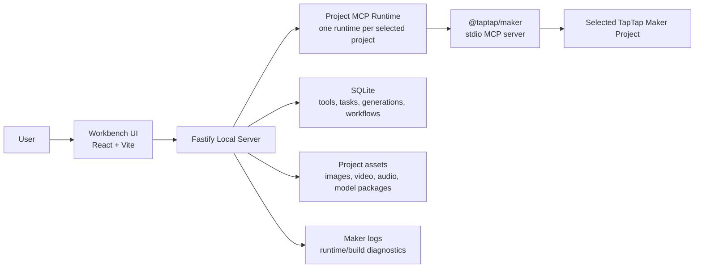
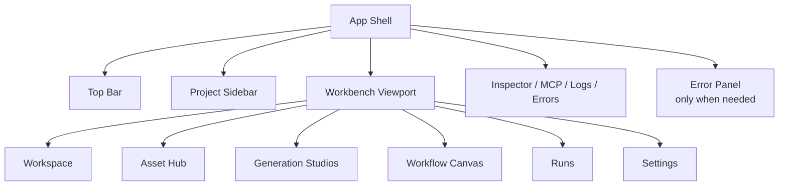
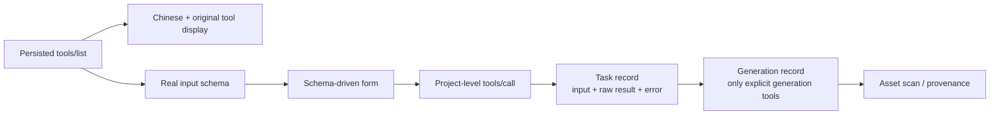
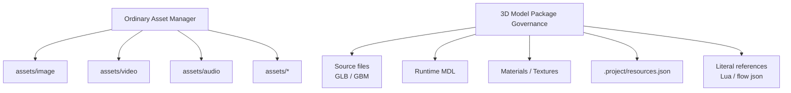
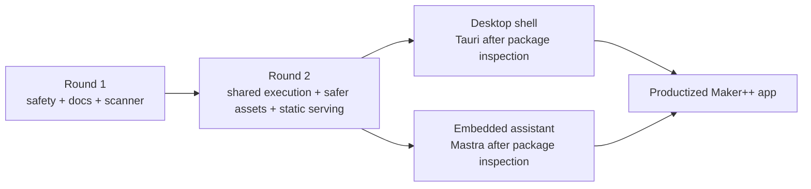

# TapTap Maker Plus Productization Graph

Date: 2026-06-23
Workspace: `G:\TapTap_Maker\MCP`

This graph records the intended product architecture and productization path.

## 1. Runtime Architecture

## 2. Workbench Areas

## 3. Capability Center

## 4. Asset Governance

## 5. Productization Roadmap

## 6. Guardrails

- Browser calls local Fastify only.
- Fastify owns MCP runtime processes.
- Each project owns its own MCP runtime and cwd.
- MCP calls use real tool names and real schemas.
- Asset operations use project-relative paths and backend path safety.
- Agent features must go through existing server APIs and require human confirmation for tool calls or filesystem mutations.
- Desktop shell wraps the existing Web + Fastify kernel first; it does not rewrite the architecture.
